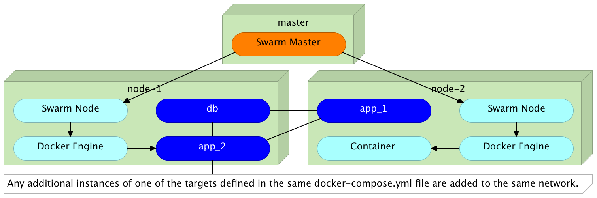

https://blog.docker.com/2016/04/docker-engine-1-11-runc/

Docker Networking and DNS: The Good, The Bad, And The Ugly
==========================================================

*Docker SDN* (Software Defined Network) already exists for quite some time. What is new, starting from the release 1.11, is the addition of *DNS round-robin load balancing*. That is both a reason for celebration and an opportunity to explore Docker SDN and DNS. We'll explore internal and external networking, see how DNS fits into the picture, discuss use cases that might be a good fit, and finish with pros and cons.

Let's start from the beginning. Since I don't know whether you're a Mac, Windows, or Linux user, we'll create a few VMs running Ubuntu and use them to simulate a Docker Swarm cluster.

Setting Up The Cluster
----------------------

TODO: Continue

```bash
git clone https://github.com/vfarcic/docker-flow.git

cd docker-flow

vagrant plugin install vagrant-cachier

vagrant up master node-1 node-2 proxy
```


```bash
vagrant ssh proxy

cd /vagrant/articles/dns

export DOCKER_HOST=tcp://master:2375

# Create network manually

docker network create backend

docker network ls

cat docker-compose.yml

docker-compose -f docker-compose.yml up -d db app

# Docker Compose created the network dns_default

docker exec -it dns_app_1 ping books-ms-db

docker exec -it books-ms-db ping dns_app_1
```


```bash
docker-compose -f docker-compose.yml scale app=2

docker exec -it dns_app_1 ping dns_app_2

docker exec -it dns_app_2 ping dns_app_1

docker exec -it dns_app_2 ping books-ms-db

docker run -it --rm alpine ping books-ms-db
```



```bash
docker run -it --rm --net backend alpine ping dns_app_1

docker run -it --rm --net backend alpine ping dns_app_2

docker run -it --rm --net backend alpine ping books-ms-db
```


```bash
docker run -it --rm --net backend alpine ping books-ms

docker run -it --rm --net backend alpine ping books-ms

docker run -it --rm --net backend alpine ping books-ms
```

Pros:

* Easy to setup.
* Great for communication between containers forming the same service.

Cons:

* Not for public facing access.
* Does not substitute "real" proxy
* Difficulties with "real" proxy checks
* Extra note: while the DNS resolver in Engine 1.11 will randomize records (i.e. return them in a different order at each request), most DNS resolvers will sort the records; so a "naive" client will end up always connecting to the same backend.

TODO: Docker Flow

Swarm Rescheduling
==================

TODO